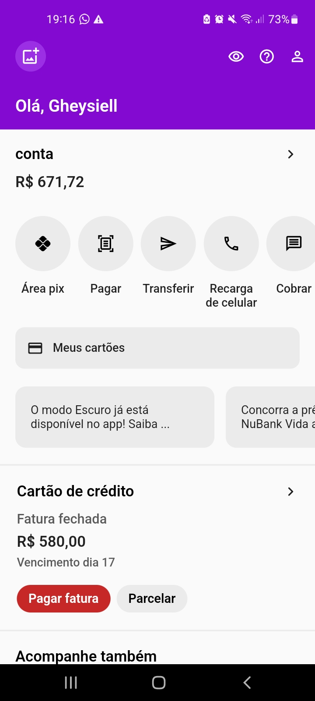

# Nubank Clone

  

 <h2> App feito em Flutter clonando interface do NuBank </h2> 

 <h5> ° Para instalar dependências execute: flutter pub get </h5> 

 <h5> ° Para iniciar o aplicativo no modo de depuração: na mesma pasta e execute: flutter run --debug </h5> 

 <h5> ° Para iniciar o aplicativo no modo de lançamento: na mesma pasta e execute: flutter run --release </h5> 
 
